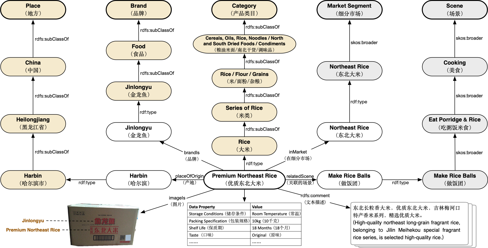

# OpenBG：Large Scale Open Business Knowledge Graph

<p align="left">
    <b>  <a href="https://github.com/OpenBGBenchmark/OpenBG/blob/main/README_CN.md">Chinese</a> | English </b>
</p>

[OpenBG](https://kg.alibaba.com/) is an open business knowledge graph that utilizes a unified Schema covering multi-modal datasets in large scale, which contains millions of products and consumer demand provided by ZJUKG Lab of Zhejiang University and the group of Alibaba Knowledge Engine.

[OpenBG Benchmark](https://tianchi.aliyun.com/dataset/dataDetail?dataId=122271) is a large-scale open business knowledge graph evaluation benchmark based on OpenBG, including multiple sub-datasets and sub-tasks. Welcome submission in [https://tianchi.aliyun.com/dataset/dataDetail?dataId=122271](https://tianchi.aliyun.com/dataset/dataDetail?dataId=122271).

Paper: **Construction and Applications of Billion-Scale Pre-trained Multimodal Business Knowledge Graph** \[[pdf](https://arxiv.org/abs/2209.15214)\]

## Building process of OpenBG benchmarks
<center></center>

## Datasets

Summary statistics of OpenBG datasets:
|    Dataset    |    # Ent   | # Rel |   # Train   |  # Dev  | # Test  |
| ------------- | ---------- | ----- | ----------- | ------- | ------- |
|   [OpenBG-IMG](https://drive.google.com/file/d/1jg4YcFgOfgjUJCnxBjw9w-6ID8VS_L-X/view?usp=sharing)  | 27,910     |  136  | 230,087     | 5,000   | 14,675  |
|   [OpenBG500](https://drive.google.com/file/d/1pD_icqV-lLbCXN2rfBaq-Y5i_XcKVCzM/view?usp=sharing)   | 249,743    |  500  | 1,242,550   | 5,000   |  5,000  |
|   [OpenBG500-L](https://drive.google.com/file/d/1DZZRqc8Yl9mfO66cOS8IKCuim_Bw2oOM/view?usp=sharing) | 2,782,223  |  500  | 47,410,032  | 10,000  | 10,000  |
|  OpenBG(Full) | 88,881,723 | 2,681 | 260,304,683 |    -    |    -    |

### OpenBG-IMG
OpenBG-IMG is a multi-modal dataset in the field of e-commmerce referring to [CCKS2022 Knowledge Processing and Application Evaluation for Digital Commerce Task 3: Multimodal Commodity Knowledge Graph Link Prediction](https://tianchi.aliyun.com/competition/entrance/531957/information). OpenBG-IMG here has an extra dev split and texts of entities and relations compared to the original dataset in CCKS. The test split refers to the preliminary contest.

**Input-output example:**
Input: (`Head`[some with `image`]<\t>`Relation`)
Output: (`Tail`)

#### Download

- [https://drive.google.com/file/d/1jg4YcFgOfgjUJCnxBjw9w-6ID8VS_L-X/view?usp=sharing](https://drive.google.com/file/d/1jg4YcFgOfgjUJCnxBjw9w-6ID8VS_L-X/view?usp=sharing)

#### Directory Tree

```shell
OpenBG-IMG
├───── OpenBG-IMG_images			# Set of images
	├── ent_xxxxxx					# Images of the entity
	...
├── OpenBG-IMG_train.tsv 			# Training set
├── OpenBG-IMG_dev.tsv 				# Validation set
├── OpenBG-IMG_test.tsv 			# Test set
├── OpenBG-IMG_entity2text.tsv 		# Description of entities in Chinese
├── OpenBG-IMG_relation2text.tsv 	# Description of relations in Chinese
└── OpenBG-IMG_example_pred.tsv 	# Submit example
```

#### Baselines

- https://github.com/OpenBGBenchmark/OpenBG-IMG
- [MKGformer](https://github.com/zjunlp/MKGformer/)

### OpenBG500

OpenBG500 contains 500 relations, which is filtered and sampled from OpenBG(Full).

#### Download 

- [https://drive.google.com/file/d/1pD_icqV-lLbCXN2rfBaq-Y5i_XcKVCzM/view?usp=sharing](https://drive.google.com/file/d/1pD_icqV-lLbCXN2rfBaq-Y5i_XcKVCzM/view?usp=sharing)


#### Directory Tree
```shell
OpenBG500
├── OpenBG500_train.tsv 			# Training set
├── OpenBG500_dev.tsv 				# Validation set
├── OpenBG500_test.tsv 			    # Test set
├── OpenBG500_entity2text.tsv 		# Description of entities in Chinese
├── OpenBG500_relation2text.tsv 	# Description of relations in Chinese
└── OpenBG500_example_pred.tsv 	    # Submit example
```

#### Baselines
- https://github.com/OpenBGBenchmark/OpenBG500
- [KNN-KG](https://github.com/zjunlp/KNN-KG)
- [GenKGC](https://arxiv.org/abs/2202.02113)

### OpenBG500-L

OpenBG500-L contains 500 relations(same as OpenBG500), larger than OpenBG500, which is also filtered and sampled from OpenBG(Full).

#### Download 

- [https://drive.google.com/file/d/1DZZRqc8Yl9mfO66cOS8IKCuim_Bw2oOM/view?usp=sharing](https://drive.google.com/file/d/1DZZRqc8Yl9mfO66cOS8IKCuim_Bw2oOM/view?usp=sharing)

#### Directory Tree
```shell
OpenBG500-L
├── OpenBG500-L_train.tsv 			    # Training set
├── OpenBG500-L_dev.tsv 				# Validation set
├── OpenBG500-L_test.tsv 			    # Test set
├── OpenBG500-L_entity2text.tsv 		# Description of entities in Chinese
├── OpenBG500-L_relation2text.tsv 	    # Description of relations in Chinese
└── OpenBG500-L_example_pred.tsv 	    # Submit example
```

#### Baselines

- [KNN-KG](https://github.com/zjunlp/KNN-KG)
- [GenKGC](https://arxiv.org/abs/2202.02113)

## Simple Usage

### Format

* Triples

```shell
# {Dataset}_train.tsv/{Dataset}_dev.tsv
Head<\t>Relation<\t>Tail<\n>
```

* Description of entities/relations in Chinese

```shell
# {Dataset}_entity2text.tsv/{Dataset}_relation2text.tsv
Entity(Relation)<\t>Description of entitie(relation)<\n>
```

* Test and submit

```shell
# For {Dataset}_test.tsv, participants are required to predict 10 Tails for one instance. {Dataset}_example_pred.tsv is a submit example.
Head<\t>Relation<\n>

# {Dataset}_example_pred.tsv
Head<\t>Relation<\t>Tail 1<\t>Tail 2<\t>...<\t>Tail 10<\n>
```

### Check the data

```
$ head -n 3 {Dataset}_train.tsv
ent_135492      rel_0352        ent_015651
ent_020765      rel_0448        ent_214183
ent_106905      rel_0418        ent_121073
```

### Read the datasets

1. Read the original data:
```python
with open('{Dataset}_train.tsv', 'r') as fp:
    data = fp.readlines()
    train = [line.strip('\n').split('\t') for line in data]
    _ = [print(line) for line in train[:2]]
    # ['ent_135492', 'rel_0352', 'ent_015651']
    # ['ent_020765', 'rel_0448', 'ent_214183']
```

2. Get the map of Entity(Relatioin)-Description: `ent2text` and `rel2text`:
```python
with open('{Dataset}_entity2text.tsv', 'r') as fp:
    data = fp.readlines()
    lines = [line.strip('\n').split('\t') for line in data]
    _ = [print(line) for line in lines[:2]]
    # ['ent_101705', '短袖T恤']
    # ['ent_116070', '套装']

ent2text = {line[0]: line[1] for line in lines}

with open('{Dataset}_relation2text.tsv', 'r') as fp:
    data = fp.readlines()
    lines = [line.strip().split('\t') for line in data]
    _ = [print(line) for line in lines[:2]]
    # ['rel_0418', '细分市场']
    # ['rel_0290', '关联场景']

rel2text = {line[0]: line[1] for line in lines}
```

3. Transfer the data to description: 
```python
train = [[ent2text[line[0]],rel2text[line[1]],ent2text[line[2]]] for line in train]
_ = [print(line) for line in train[:2]]
# ['苦荞茶', '外部材质', '苦荞麦']
# ['精品三姐妹硬糕', '口味', '原味硬糕850克【10包40块糕】']
```
## Package Usage

## How to download

- Download link：

| Dataset       |   Google Drive   | Baidu Netdisk | 
| ------------- | ---------------- | ------ |
| OpenBG-IMG    | [Download](https://drive.google.com/file/d/1jg4YcFgOfgjUJCnxBjw9w-6ID8VS_L-X/view?usp=sharing)    |   [Password: ke65](https://pan.baidu.com/s/1rq1AGTSKLcfuIEnuq6gnJQ) |
| OpenBG500     |    [Download](https://drive.google.com/file/d/1pD_icqV-lLbCXN2rfBaq-Y5i_XcKVCzM/view?usp=sharing)    |   [Password: 78fw](https://pan.baidu.com/s/1NsRWct-u63QmxVgyjJeXsg) |
| OpenBG500-L   | [Download](https://drive.google.com/file/d/1DZZRqc8Yl9mfO66cOS8IKCuim_Bw2oOM/view?usp=sharing) | [Password: 767v](https://pan.baidu.com/s/1SbTs7HFfHIrYSlK_hoLxTg) |

- OpenBG(Full) is available at [kg.alibaba.com](https://kg.alibaba.com/).

## Submit in Alibaba TIANCHI

- OpenBG-IMG is available at [CCKS2022 Knowledge Processing and Application Evaluation for Digital Commerce Task 3: Multimodal Commodity Knowledge Graph Link Prediction](https://tianchi.aliyun.com/competition/entrance/531957/information), and the source code of baselines is https://github.com/OpenBGBenchmark/OpenBG-IMG.
- [OpenBG Benchmark：Large Scale Open Business Knowledge Graph Benchmark](https://tianchi.aliyun.com/dataset/dataDetail?dataId=122271) is a benchmark open for a long time.

### How to submit

- Results of [OpenBG Benchmark：大规模开放数字商业知识图谱评测基准](https://tianchi.aliyun.com/dataset/dataDetail?dataId=122271) can submit on the website:

<center></center>

1. Every submit file must follow the name format:
* OpenBG500: OpenBG500_test.tsv
* OpenBG500-L: OpenBG500-L_test.tsv
* OpenBG-IMG: OpenBG-IMG_test.tsv

2. Compress file to `.zip` and submit.

```
zip somename.zip  {Dataset}_test.tsv
```

## OpenBG(Full) Dataset

商业要素涉及多种不同类型的知识，我们针对不同的知识类型采用不同的知识建模方法。例如针对标品知识所涉及的类目及属性关系型知识，我们采用本体表示语言进行建模；对于概念型知识我们采用更为简单概念层次关系表示方法；对于实体关系型知识我们采用属性图Property Graph方式进行建模；对于商业规则知识我们采用规则知识建模方法。通过建立一套基于消费者需求场景的知识图谱表示体系来组织商品，并把商业要素知识沉淀到图谱中，以解决业务痛点。OpenBG已经包含近200万元组的本体三元组，一百多万条概念知识，近十多亿的实体关系三元组，以及二十多万条的规则型知识（待发布）。下图是一个案例，展示了OpenBG的数据组织形式。
<font class=center></font>
<br/>
### 格式/协议

数据分为TBox、ABox和sample_data三部分，支持.ttl、.nt、.jsonld、.owl四种数据格式。
其中，i）.ttl、.owl格式: 与 .xml 格式类似；ii）.nt: 三元组格式，每一行的数据格式为[头实体]\t[关系]\t[尾实体]；iii）.jsonld 与 .json格式类似。

- ❗对于OpenBG中所定义的class，包括Category、Brand、Place，他们的实体所对应的中文明文是**rdfs:label**这一关系所对应的尾实体，英文明文是**http://ali.openkg.cn/alischema#Property/labelEn** 这一关系所对应的尾实体

- ❗对于OpenBG中所定义的concept，包括Time、Scene、Crowd、Theme、Market Segment，他们的实体所对应的中文明文是**skos:prefLabel**这一关系所对应的尾实体，英文明文是**skos:altLabel**这一关系所对应的尾实体

- ❗比如对于例子: **http://ali.openkg.cn/alischema#Crowd/tag_c86346d1f960eb685b171f73d02e320c** (此为URI非URL), 其属于Crowd这一concept的uri，可以通过搜索这一uri，以及关系**skos:prefLabel**、**skos:altLabel**找到尾实体，这就是它所对应的中英文label明文

关于数据集的详细内容，可以参考论文: [https://arxiv.org/pdf/2209.15214.pdf](https://arxiv.org/pdf/2209.15214.pdf)。


### 数据集统计信息
|类型| 数量 |
|--|--|
| 类及属性个数 | 46万+ |
| 核心概念书 | 67万+ |
| 标准产品数 | 306万+ |
| 总实体数 | 1600万+ |
| 总三元组数 | 18亿+ |
<br />

### 文件清单
**ABox分为以下8个子压缩文件：**
<table>
	<tr>
	<th>文件名</th>
	<th>包含文件</th>
	</tr>
    <tr>
        <td rowspan="4">OpenBG_ABox_Part1.zip包括如下文件</td>
    <td> OpenBG_ABox_Product_OriginStr_Attributes.nt.tar.gz</td>
    </tr>
    <tr>
    <td> OpenBG_ABox_Product_OriginStr_Attributes.ttl.tar.gz</td>
    </tr>
        <tr>
    <td> OpenBG_ABox_Product_OriginStr_wClass.nt</td>
    </tr>
            <tr>
    <td> OpenBG_ABox_Product_OriginStr_wClass.ttl</td>
    </tr>
    <tr>
        <td rowspan="4">OpenBG_ABox_Part2.zip包括如下文件</td>
    <td> OpenBG_ABox_Product_OriginStr_wConcept_marketOnly_part1.ttl.tar.gz</td>
    </tr>
    <tr>
    <td> OpenBG_ABox_Product_OriginStr_wConcept_marketOnly_part2.ttl.tar.gz</td>
    </tr>
        <tr>
    <td> OpenBG_ABox_Product_OriginStr_wConcept_marketOnly_part3.ttl.tar.gz</td>
    </tr>
            <tr>
    <td> OpenBG_ABox_Product_OriginStr_wConcept_marketOnly_part4.ttl.tar.gz</td>
    </tr>
    <tr>
        <td rowspan="4">OpenBG_ABox_Part3.zip包括如下文件</td>
    <td> OpenBG_ABox_Product_OriginStr_wConcept_marketOnly_part5.ttl.tar.gz</td>
    </tr>
    <tr>
    <td> OpenBG_ABox_Product_OriginStr_wConcept_marketOnly_part6.ttl.tar.gz</td>
    </tr>
        <tr>
    <td> OpenBG_ABox_Product_OriginStr_wConcept_marketOnly_part7.ttl.tar.gz</td>
    </tr>
            <tr>
    <td> OpenBG_ABox_Product_OriginStr_wConcept_marketOnly_part8.ttl.tar.gz</td>
    </tr>
    <tr>
        <td rowspan="4">OpenBG_ABox_Part4.zip包括如下文件</td>
    <td> OpenBG_ABox_Product_OriginStr_wConcept_marketOnly_part9.ttl.tar.gz</td>
    </tr>
    <tr>
    <td> OpenBG_ABox_Product_OriginStr_wConcept_marketOnly_part10.ttl.tar.gz</td>
    </tr>
        <tr>
    <td> OpenBG_ABox_Product_OriginStr_wConcept_marketOnly_part11.ttl.tar.gz</td>
    </tr>
            <tr>
    <td> OpenBG_ABox_Product_OriginStr_wConcept_marketOnly_part12.ttl.tar.gz</td>
    </tr>
    <tr>
        <td rowspan="4">OpenBG_ABox_Part5.zip包括如下文件</td>
    <td> OpenBG_ABox_Product_OriginStr_wConcept_marketOnly_part13.ttl.tar.gz</td>
    </tr>
    <tr>
    <td> OpenBG_ABox_Product_OriginStr_wConcept_marketOnly_part14.ttl.tar.gz</td>
    </tr>
        <tr>
    <td> OpenBG_ABox_Product_OriginStr_wConcept_marketOnly_part15.ttl.tar.gz</td>
    </tr>
            <tr>
    <td> OpenBG_ABox_Product_OriginStr_wConcept_marketOnly_part16.ttl.tar.gz</td>
    </tr>
    <tr>
        <td rowspan="4">OpenBG_ABox_Part6.zip包括如下文件</td>
    <td> OpenBG_ABox_Product_OriginStr_wConcept_marketOnly_part17.ttl.tar.gz</td>
    </tr>
    <tr>
    <td> OpenBG_ABox_Product_OriginStr_wConcept_marketOnly_part18.ttl.tar.gz</td>
    </tr>
        <tr>
    <td> OpenBG_ABox_Product_OriginStr_wConcept_marketOnly_part19.ttl.tar.gz</td>
    </tr>
            <tr>
    <td> OpenBG_ABox_Product_OriginStr_wConcept_marketOnly_part20.ttl.tar.gz</td>
    </tr>
    <tr>
        <td rowspan="10">OpenBG_ABox_Part7.zip包括如下文件</td>
    <td> OpenBG_ABox_Product_OriginStr_wConcept_part1.nt.tar.gz</td>
    </tr>
    <tr>
    <td> OpenBG_ABox_Product_OriginStr_wConcept_part1.ttl.tar.gz</td>
    </tr>
        <tr>
    <td> OpenBG_ABox_Product_OriginStr_wConcept_part2.nt.tar.gz</td>
    </tr>
            <tr>
    <td> OpenBG_ABox_Product_OriginStr_wConcept_part2.ttl.tar.gz</td>
    </tr>
        <tr>
    <td> OpenBG_ABox_Product_OriginStr_wConcept_part3.nt.tar.gz</td>
    </tr>
            <tr>
    <td> OpenBG_ABox_Product_OriginStr_wConcept_part3.ttl.tar.gz</td>
    </tr>
        <tr>
    <td> OpenBG_ABox_Product_OriginStr_wConcept_part4.nt.tar.gz</td>
    </tr>
            <tr>
    <td> OpenBG_ABox_Product_OriginStr_wConcept_part4.ttl.tar.gz</td>
    </tr>
        <tr>
    <td> OpenBG_ABox_Product_OriginStr_wConcept_part5.nt.tar.gz</td>
    </tr>
            <tr>
    <td> OpenBG_ABox_Product_OriginStr_wConcept_part5.ttl.tar.gz</td>
    </tr>
    <tr>
        <td rowspan="8">OpenBG_ABox_Part8.zip包括如下文件</td>
    <td> OpenBG_ABox_Product_OriginStr_wConcept_part6.nt.tar.gz</td>
    </tr>
    <tr>
    <td> OpenBG_ABox_Product_OriginStr_wConcept_part6.ttl.tar.gz</td>
    </tr>
        <tr>
    <td> OpenBG_ABox_Product_OriginStr_wConcept_part7.nt.tar.gz</td>
    </tr>
            <tr>
    <td> OpenBG_ABox_Product_OriginStr_wConcept_part7.ttl.tar.gz</td>
    </tr>
        <tr>
    <td> OpenBG_ABox_Product_OriginStr_wConcept_part8.nt.tar.gz</td>
    </tr>
            <tr>
    <td> OpenBG_ABox_Product_OriginStr_wConcept_part8.ttl.tar.gz</td>
    </tr>
        <tr>
    <td> OpenBG_ABox_Product_OriginStr_wConcept_part9.nt.tar.gz</td>
    </tr>
            <tr>
    <td> OpenBG_ABox_Product_OriginStr_wConcept_part9.ttl.tar.gz</td>
    </tr>
</table>
   

#### TBox包含1个压缩文件：
<table>
	<tr>
	<th>文件名</th>
	<th>包含文件</th>
	</tr>
    <tr>
        <td rowspan="3">OpenBG_TBox.zip包括如下文件</td>
    <td> OpenBG_TBox_All_OriginStr.jsonld</td>
    </tr>
    <tr>
    <td>OpenBG_TBox_All_OriginStr.jsonld</td>
    </tr>
    <tr>
    <td>OpenBG_TBox_All_OriginStr.nt</td>
    </tr>
    <tr>
    <td>OpenBG_TBox_All_OriginStr.ttl</td>
    </tr>
</table>
    

#### Sample_data包含1个压缩文件：

-   Sample_data.zip
    

<br/>

**文件说明：**
OpenBG_ABox文件：主要包含标准产品、类和概念实例的关系以及本身的属性信息
|文件类型| 文件内容 |
|--|--|
| OpenBG_ABox_Product_OriginStr_Attributes.[nt&#124;tl] | 主要包含产品属性信息 |
|  OpenBG_ABox_Product_OriginStr_wClass.[nt&#124;ttl] | 主要包含产品和类别信息，以及与产地、品牌的关联信息 |
| OpenBG_ABox_Product_OriginStr_wConcept_marketOnly_part[1-20].ttl | 主要包含产品与5类概念（场景、人群、适用时间、主题、细分市场）实例的联系 | 
| OpenBG_ABox_Product_OriginStr_wConcept_part[1-9].[nt&#124;ttl] | 主要包含产品与细分市场这一概念的实例的联系 |

OpenBG_TBox文件：主要包含核心类（class）和属性知识、核心概念（concept）的上下位层级知识
|文件类型| 文件内容 |
|--|--|
|OpenBG_TBox_All_OriginStr.[nt&#124;ttl&#124;jsonld]|主要包含OpenBG本体层面的知识（仅包含类和概念，不包含类和概念的实例）|

sample_data文件:小样本数据

<br />

## Citation

If you use the data or code, please cite the following paper:

```bibtex
@article{ICDE2023_OpenBG,
  author    = {Shumin Deng and
               Chengming Wang and
               Zhoubo Li and
               Ningyu Zhang and
               Zelin Dai and
               Hehong Chen and
               Feiyu Xiong and
               Ming Yan and
               Qiang Chen and
               Mosha Chen and
               Jiaoyan Chen and
               Jeff Z. Pan and
               Bryan Hooi and
               Huajun Chen},
  title     = {Construction and Applications of Billion-Scale Pre-trained Multimodal
               Business Knowledge Graph},
  journal   = {CoRR},
  volume    = {abs/2209.15214},
  year      = {2023},
  url       = {https://doi.org/10.48550/arXiv.2209.15214},
  doi       = {10.48550/arXiv.2209.15214},
  eprinttype = {arXiv},
  eprint    = {2209.15214}
}
```


## 遵循协议

数据集遵循[CC BY-SA 4.0](http://creativecommons.org/licenses/by-sa/4.0/legalcode) 协议。
