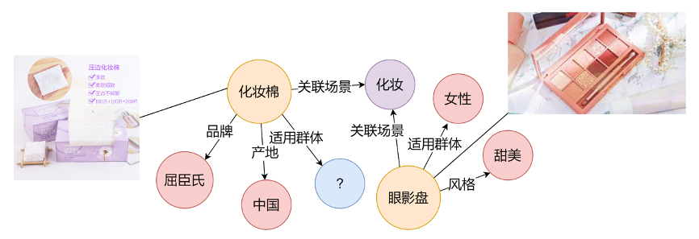
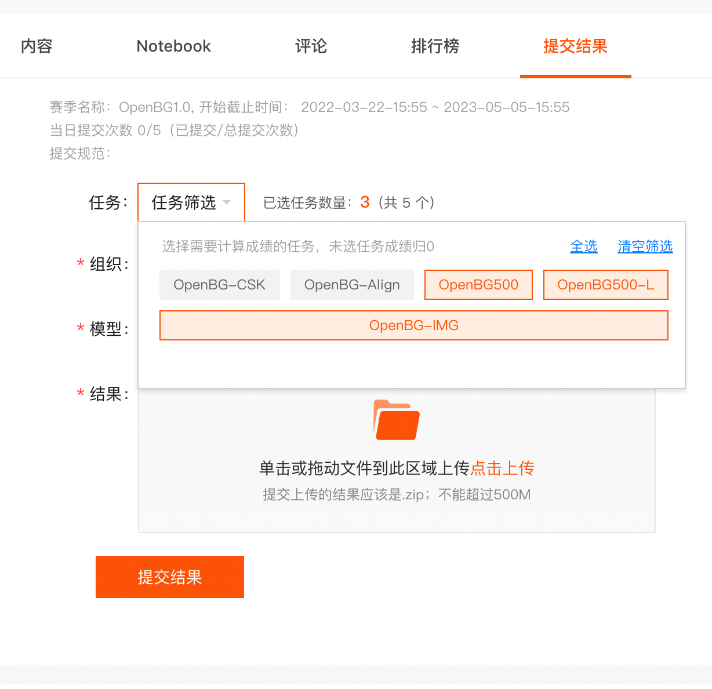

# OpenBG：大规模开放数字商业知识图谱

<p align="left">
    <b> 简体中文 | <a href="https://github.com/OpenBGBenchmark/OpenBG/blob/main/README.md">English</a> </b>
</p>

[OpenBG](https://kg.alibaba.com/)是开放的数字商业知识图谱，是一个使用统一Schema组织、涵盖产品和消费需求的百万级多模态数据集。OpenBG由阿里巴巴藏经阁团队联合提供，开放的目标是利用开放的商业知识发现社会经济的价值，促进数字商务数字经济等领域的交叉学科研究，服务数字经济健康发展的国家战略需求。

[OpenBG Benchmark](https://tianchi.aliyun.com/dataset/dataDetail?dataId=122271)是一个以OpenBG为基础构建的大规模开放数字商业知识图谱评测基准，包含多个子数据集和子任务。欢迎小伙伴打榜[https://tianchi.aliyun.com/dataset/dataDetail?dataId=122271](https://tianchi.aliyun.com/dataset/dataDetail?dataId=122271)。

论文: **Construction and Applications of Billion-Scale Pre-trained Multimodal Business Knowledge Graph** \[[pdf](https://arxiv.org/abs/2209.15214)\]


## 数据集构建流程
<center></center>

## 数据集

数据集统计数据如下：
|    Dataset    |    # Ent   | # Rel |   # Train   |  # Dev  | # Test  |
| ------------- | ---------- | ----- | ----------- | ------- | ------- |
|   OpenBG-IMG  | 27,910     |  136  | 230,087     | 5,000   | 14,675  |
|   OpenBG500   | 249,743    |  500  | 1,242,550   | 5,000   |  5,000  |
|   OpenBG500-L | 2,782,223  |  500  | 47,410,032  | 10,000  | 10,000  |
|  OpenBG(Full) | 88,881,723 | 2,681 | 260,304,683 |    -    |    -    |


### OpenBG-IMG
OpenBG-IMG是电子商务领域的多模态知识图谱，来自于<a href="https://tianchi.aliyun.com/competition/entrance/531957/introduction">CCKS2022面向数字商务的知识处理与应用评测任务三：多模态商品知识图谱链接预测</a>。OpenBG-IMG数据集相比原CCKS竞赛数据集，添加了新的dev划分，并且添加了实体和关系的文本信息，测试集来自CCKS竞赛初赛测试集。

多模态链接预测指的是给定一个三元组的头实体、头实体图片和关系，预测对应的尾实体，如下图所示：

<center></center>

其中80%的头实体会给出图片信息。
输入：（头实体[部分有图片]<\t>关系）
输出：（尾实体）

#### 数据集目录结构

```
OpenBG-IMG
├───── OpenBG-IMG_images			# 图片集
	├── ent_xxxxxx					# 实体对应图片
	...
├── OpenBG-IMG_train.tsv 			# 训练数据
├── OpenBG-IMG_dev.tsv 				# 验证数据
├── OpenBG-IMG_test.tsv 			# 需要预测的数据，选手需为每条记录预测10个尾实体
├── OpenBG-IMG_entity2text.tsv 		# 实体对应文本
├── OpenBG-IMG_relation2text.tsv 	# 关系对应文本
└── OpenBG-IMG_example_pred.tsv 	# 提交结果示例
```

#### 基线

- https://github.com/OpenBGBenchmark/OpenBG-IMG
- [MKGformer](https://github.com/zjunlp/MKGformer/)

### OpenBG500

OpenBG500包含500个关系，从OpenBG中筛选采样得到。

#### 数据集目录结构
```shell
OpenBG500
├── OpenBG500_train.tsv 			# 训练数据
├── OpenBG500_dev.tsv 				# 验证数据
├── OpenBG500_test.tsv 				# 需要预测的数据，选手需为每条记录预测10个尾实体
├── OpenBG500_entity2text.tsv 		# 实体对应文本
├── OpenBG500_relation2text.tsv 	# 关系对应文本
└── OpenBG500_example_pred.tsv 		# 提交结果示例
```

#### 基线

- https://github.com/OpenBGBenchmark/OpenBG500
- [KNN-KG](https://github.com/zjunlp/KNN-KG)
- [GenKGC](https://arxiv.org/abs/2202.02113)

### OpenBG500-L

OpenBG500-L包含500个关系，从OpenBG中筛选采样得到，规模比OpenBG大。

#### 数据集目录结构
```shell
OpenBG500-L
├── OpenBG500-L_train.tsv 				# 训练数据
├── OpenBG500-L_dev.tsv 				# 验证数据
├── OpenBG500-L_test.tsv 				# 需要预测的数据，选手需为每条记录预测10个尾实体
├── OpenBG500-L_entity2text.tsv 		# 实体对应文本
├── OpenBG500-L_relation2text.tsv 		# 关系对应文本
└── OpenBG500-L_example_pred.tsv 		# 提交结果示例
```

#### 基线

- [KNN-KG](https://github.com/zjunlp/KNN-KG)
- [GenKGC](https://arxiv.org/abs/2202.02113)

### OpenBG(Full)

秉承“利用开放的商业知识发现社会经济价值”的理念，大规模开放数字商业知识图谱OpenBG发布。OpenBG第一个版本已包含了超过18亿的三元组，多达67万的核心概念，2681类关系。

OpenBG(Full)的详细信息见文末或OpenBG官方网站[https://kg.alibaba.com](https://kg.alibaba.com)。

## 使用数据

### 数据集格式

* 三元组数据，tsv格式

```shell
# {数据集}_train.tsv/{数据集}_dev.tsv
头实体<\t>关系<\t>尾实体<\n>
```

* 实体/关系对应文本数据，tsv格式

```shell
# {数据集}_entity2text.tsv/{数据集}_relation2text.tsv
实体（关系）<\t>实体（关系）对应文本<\n>
```

* 评测相关数据格式

```shell
# {数据集}_test.tsv，选手需要为每行记录补充10格预测的尾实体，提交格式参照{数据集}_example_pred.tsv
头实体<\t>关系<\n>

# {数据集}_example_pred.tsv
头实体<\t>关系<\t>尾实体1<\t>尾实体2<\t>...<\t>尾实体10<\n>
```

### 查看数据集数据

```
$ head -n 3 {数据集}_train.tsv
ent_135492      rel_0352        ent_015651
ent_020765      rel_0448        ent_214183
ent_106905      rel_0418        ent_121073
```

### 使用python读取并转换数据集

1. 读取原始数据：
```python
with open('{数据集}_train.tsv', 'r') as fp:
    data = fp.readlines()
    train = [line.strip('\n').split('\t') for line in data]
    _ = [print(line) for line in train[:2]]
    # ['ent_135492', 'rel_0352', 'ent_015651']
    # ['ent_020765', 'rel_0448', 'ent_214183']
```

2. 获取实体、关系对应文本字典：`ent2text`和`rel2text`
```python
with open('{数据集}_entity2text.tsv', 'r') as fp:
    data = fp.readlines()
    lines = [line.strip('\n').split('\t') for line in data]
    _ = [print(line) for line in lines[:2]]
    # ['ent_101705', '短袖T恤']
    # ['ent_116070', '套装']

ent2text = {line[0]: line[1] for line in lines}

with open('{数据集}_relation2text.tsv', 'r') as fp:
    data = fp.readlines()
    lines = [line.strip().split('\t') for line in data]
    _ = [print(line) for line in lines[:2]]
    # ['rel_0418', '细分市场']
    # ['rel_0290', '关联场景']

rel2text = {line[0]: line[1] for line in lines}
```

3. 数据转换成文本：
```python
train = [[ent2text[line[0]],rel2text[line[1]],ent2text[line[2]]] for line in train]
_ = [print(line) for line in train[:2]]
# ['苦荞茶', '外部材质', '苦荞麦']
# ['精品三姐妹硬糕', '口味', '原味硬糕850克【10包40块糕】']
```

## 获取数据

- 数据集下载链接：

| Dataset       |   Google Drive   | 百度网盘 | 
| ------------- | ---------------- | ------ |
| OpenBG-IMG    | [下载链接](https://drive.google.com/file/d/1jg4YcFgOfgjUJCnxBjw9w-6ID8VS_L-X/view?usp=sharing)    |   [提取码ke65](https://pan.baidu.com/s/1rq1AGTSKLcfuIEnuq6gnJQ) |
| OpenBG500     |    [下载链接](https://drive.google.com/file/d/1pD_icqV-lLbCXN2rfBaq-Y5i_XcKVCzM/view?usp=sharing)    |   [提取码78fw](https://pan.baidu.com/s/1NsRWct-u63QmxVgyjJeXsg) |
| OpenBG500-L   | [下载链接](https://drive.google.com/file/d/1DZZRqc8Yl9mfO66cOS8IKCuim_Bw2oOM/view?usp=sharing) | [提取码767v](https://pan.baidu.com/s/1SbTs7HFfHIrYSlK_hoLxTg) |


- OpenBG(Full)数据集可以在[kg.alibaba.com](https://kg.alibaba.com/)申请获取

## 阿里天池评测

- OpenBG-IMG数据集来自阿里天池[CCKS2022面向数字商务的知识处理与应用评测任务三：多模态商品知识图谱链接预测](https://tianchi.aliyun.com/competition/entrance/531957/information)，baseline代码请关注https://github.com/OpenBGBenchmark/OpenBG-IMG 。
- 阿里天池数据集[OpenBG Benchmark：大规模开放数字商业知识图谱评测基准](https://tianchi.aliyun.com/dataset/dataDetail?dataId=122271)将长期开放数据集的评测。

### 如何提交

阿里天池数据集[OpenBG Benchmark：大规模开放数字商业知识图谱评测基准](https://tianchi.aliyun.com/dataset/dataDetail?dataId=122271)的结果需要在天池的界面提交。

<center></center>

1. 每个任务的预测文件，**提交文件需要严格命名为 ${数据集}_test.tsv**，每个任务对应的提交文件名为：
* OpenBG500: OpenBG500_test.tsv
* OpenBG500-L: OpenBG500-L_test.tsv
* OpenBG-IMG: OpenBG-IMG_test.tsv

2. 每个任务生成一个预测文件，输出内容见各任务的要求，也可参照各任务目录下的${数据集名称}_example_pred.tsv文件，所有的预测文件压缩为zip格式在数据集的“提交结果”页面进行提交，压缩命令是:

```
zip somename.zip  {数据集}_test.tsv
```

**注：请用zip压缩命令来进行压缩，保证解压后的结果是tsv文件，不可再包含中间目录层。**

3. 选手可以只提交部分任务的结果，如只提交“OpenBG500”任务：zip somename.zip OpenBG500_test.tsv，未预测任务的分数默认为0。

## OpenBG(Full)解读

商业要素涉及多种不同类型的知识，我们针对不同的知识类型采用不同的知识建模方法。例如针对标品知识所涉及的类目及属性关系型知识，我们采用本体表示语言进行建模；对于概念型知识我们采用更为简单概念层次关系表示方法；对于实体关系型知识我们采用属性图Property Graph方式进行建模；对于商业规则知识我们采用规则知识建模方法。通过建立一套基于消费者需求场景的知识图谱表示体系来组织商品，并把商业要素知识沉淀到图谱中，以解决业务痛点。OpenBG已经包含近200万元组的本体三元组，一百多万条概念知识，近十多亿的实体关系三元组，以及二十多万条的规则型知识（待发布）。下图是一个案例，展示了OpenBG的数据组织形式。
<font class=center></font>
<br/>
### 格式/协议

数据分为TBox、ABox和sample_data三部分，支持.ttl、.nt、.jsonld、.owl四种数据格式。
其中，i）.ttl、.owl格式: 与 .xml 格式类似；ii）.nt: 三元组格式，每一行的数据格式为[头实体]\t[关系]\t[尾实体]；iii）.jsonld 与 .json格式类似。
<br />

- ❗对于OpenBG中所定义的class，包括Category、Brand、Place，他们的实体所对应的中文明文是**rdfs:label**这一关系所对应的尾实体，英文明文是**http://ali.openkg.cn/alischema#Property/labelEn** 这一关系所对应的尾实体

- ❗对于OpenBG中所定义的concept，包括Time、Scene、Crowd、Theme、Market Segment，他们的实体所对应的中文明文是**skos:prefLabel**这一关系所对应的尾实体，英文明文是**skos:altLabel**这一关系所对应的尾实体

- ❗比如对于例子: **http://ali.openkg.cn/alischema#Crowd/tag_c86346d1f960eb685b171f73d02e320c** (此为URI非URL), 其属于Crowd这一concept的uri，可以通过搜索这一uri，以及关系**skos:prefLabel**、**skos:altLabel**找到尾实体，这就是它所对应的中英文label明文

关于数据集的详细内容，可以参考论文: [https://arxiv.org/pdf/2209.15214.pdf](https://arxiv.org/pdf/2209.15214.pdf)。

### 数据集统计信息
|类型| 数量 |
|--|--|
| 类及属性个数 | 46万+ |
| 核心概念书 | 67万+ |
| 标准产品数 | 306万+ |
| 总实体数 | 1600万+ |
| 总三元组数 | 18亿+ |

### 文件清单
**ABox分为以下8个子压缩文件：**
<table>
	<tr>
	<th>文件名</th>
	<th>包含文件</th>
	</tr>
    <tr>
        <td rowspan="4">OpenBG_ABox_Part1.zip包括如下文件</td>
    <td> OpenBG_ABox_Product_OriginStr_Attributes.nt.tar.gz</td>
    </tr>
    <tr>
    <td> OpenBG_ABox_Product_OriginStr_Attributes.ttl.tar.gz</td>
    </tr>
        <tr>
    <td> OpenBG_ABox_Product_OriginStr_wClass.nt</td>
    </tr>
            <tr>
    <td> OpenBG_ABox_Product_OriginStr_wClass.ttl</td>
    </tr>
    <tr>
        <td rowspan="4">OpenBG_ABox_Part2.zip包括如下文件</td>
    <td> OpenBG_ABox_Product_OriginStr_wConcept_marketOnly_part1.ttl.tar.gz</td>
    </tr>
    <tr>
    <td> OpenBG_ABox_Product_OriginStr_wConcept_marketOnly_part2.ttl.tar.gz</td>
    </tr>
        <tr>
    <td> OpenBG_ABox_Product_OriginStr_wConcept_marketOnly_part3.ttl.tar.gz</td>
    </tr>
            <tr>
    <td> OpenBG_ABox_Product_OriginStr_wConcept_marketOnly_part4.ttl.tar.gz</td>
    </tr>
    <tr>
        <td rowspan="4">OpenBG_ABox_Part3.zip包括如下文件</td>
    <td> OpenBG_ABox_Product_OriginStr_wConcept_marketOnly_part5.ttl.tar.gz</td>
    </tr>
    <tr>
    <td> OpenBG_ABox_Product_OriginStr_wConcept_marketOnly_part6.ttl.tar.gz</td>
    </tr>
        <tr>
    <td> OpenBG_ABox_Product_OriginStr_wConcept_marketOnly_part7.ttl.tar.gz</td>
    </tr>
            <tr>
    <td> OpenBG_ABox_Product_OriginStr_wConcept_marketOnly_part8.ttl.tar.gz</td>
    </tr>
    <tr>
        <td rowspan="4">OpenBG_ABox_Part4.zip包括如下文件</td>
    <td> OpenBG_ABox_Product_OriginStr_wConcept_marketOnly_part9.ttl.tar.gz</td>
    </tr>
    <tr>
    <td> OpenBG_ABox_Product_OriginStr_wConcept_marketOnly_part10.ttl.tar.gz</td>
    </tr>
        <tr>
    <td> OpenBG_ABox_Product_OriginStr_wConcept_marketOnly_part11.ttl.tar.gz</td>
    </tr>
            <tr>
    <td> OpenBG_ABox_Product_OriginStr_wConcept_marketOnly_part12.ttl.tar.gz</td>
    </tr>
    <tr>
        <td rowspan="4">OpenBG_ABox_Part5.zip包括如下文件</td>
    <td> OpenBG_ABox_Product_OriginStr_wConcept_marketOnly_part13.ttl.tar.gz</td>
    </tr>
    <tr>
    <td> OpenBG_ABox_Product_OriginStr_wConcept_marketOnly_part14.ttl.tar.gz</td>
    </tr>
        <tr>
    <td> OpenBG_ABox_Product_OriginStr_wConcept_marketOnly_part15.ttl.tar.gz</td>
    </tr>
            <tr>
    <td> OpenBG_ABox_Product_OriginStr_wConcept_marketOnly_part16.ttl.tar.gz</td>
    </tr>
    <tr>
        <td rowspan="4">OpenBG_ABox_Part6.zip包括如下文件</td>
    <td> OpenBG_ABox_Product_OriginStr_wConcept_marketOnly_part17.ttl.tar.gz</td>
    </tr>
    <tr>
    <td> OpenBG_ABox_Product_OriginStr_wConcept_marketOnly_part18.ttl.tar.gz</td>
    </tr>
        <tr>
    <td> OpenBG_ABox_Product_OriginStr_wConcept_marketOnly_part19.ttl.tar.gz</td>
    </tr>
            <tr>
    <td> OpenBG_ABox_Product_OriginStr_wConcept_marketOnly_part20.ttl.tar.gz</td>
    </tr>
    <tr>
        <td rowspan="10">OpenBG_ABox_Part7.zip包括如下文件</td>
    <td> OpenBG_ABox_Product_OriginStr_wConcept_part1.nt.tar.gz</td>
    </tr>
    <tr>
    <td> OpenBG_ABox_Product_OriginStr_wConcept_part1.ttl.tar.gz</td>
    </tr>
        <tr>
    <td> OpenBG_ABox_Product_OriginStr_wConcept_part2.nt.tar.gz</td>
    </tr>
            <tr>
    <td> OpenBG_ABox_Product_OriginStr_wConcept_part2.ttl.tar.gz</td>
    </tr>
        <tr>
    <td> OpenBG_ABox_Product_OriginStr_wConcept_part3.nt.tar.gz</td>
    </tr>
            <tr>
    <td> OpenBG_ABox_Product_OriginStr_wConcept_part3.ttl.tar.gz</td>
    </tr>
        <tr>
    <td> OpenBG_ABox_Product_OriginStr_wConcept_part4.nt.tar.gz</td>
    </tr>
            <tr>
    <td> OpenBG_ABox_Product_OriginStr_wConcept_part4.ttl.tar.gz</td>
    </tr>
        <tr>
    <td> OpenBG_ABox_Product_OriginStr_wConcept_part5.nt.tar.gz</td>
    </tr>
            <tr>
    <td> OpenBG_ABox_Product_OriginStr_wConcept_part5.ttl.tar.gz</td>
    </tr>
    <tr>
        <td rowspan="8">OpenBG_ABox_Part8.zip包括如下文件</td>
    <td> OpenBG_ABox_Product_OriginStr_wConcept_part6.nt.tar.gz</td>
    </tr>
    <tr>
    <td> OpenBG_ABox_Product_OriginStr_wConcept_part6.ttl.tar.gz</td>
    </tr>
        <tr>
    <td> OpenBG_ABox_Product_OriginStr_wConcept_part7.nt.tar.gz</td>
    </tr>
            <tr>
    <td> OpenBG_ABox_Product_OriginStr_wConcept_part7.ttl.tar.gz</td>
    </tr>
        <tr>
    <td> OpenBG_ABox_Product_OriginStr_wConcept_part8.nt.tar.gz</td>
    </tr>
            <tr>
    <td> OpenBG_ABox_Product_OriginStr_wConcept_part8.ttl.tar.gz</td>
    </tr>
        <tr>
    <td> OpenBG_ABox_Product_OriginStr_wConcept_part9.nt.tar.gz</td>
    </tr>
            <tr>
    <td> OpenBG_ABox_Product_OriginStr_wConcept_part9.ttl.tar.gz</td>
    </tr>
</table>
   

#### TBox包含1个压缩文件：
<table>
	<tr>
	<th>文件名</th>
	<th>包含文件</th>
	</tr>
    <tr>
        <td rowspan="3">OpenBG_TBox.zip包括如下文件</td>
    <td> OpenBG_TBox_All_OriginStr.jsonld</td>
    </tr>
    <tr>
    <td>OpenBG_TBox_All_OriginStr.jsonld</td>
    </tr>
    <tr>
    <td>OpenBG_TBox_All_OriginStr.nt</td>
    </tr>
    <tr>
    <td>OpenBG_TBox_All_OriginStr.ttl</td>
    </tr>
</table>
    

#### Sample_data包含1个压缩文件：

-   Sample_data.zip
    

<br/>

**文件说明：**
OpenBG_ABox文件：主要包含标准产品、类和概念实例的关系以及本身的属性信息
|文件类型| 文件内容 |
|--|--|
| OpenBG_ABox_Product_OriginStr_Attributes.[nt&#124;tl] | 主要包含产品属性信息 |
|  OpenBG_ABox_Product_OriginStr_wClass.[nt&#124;ttl] | 主要包含产品和类别信息，以及与产地、品牌的关联信息 |
| OpenBG_ABox_Product_OriginStr_wConcept_marketOnly_part[1-20].ttl | 主要包含产品与5类概念（场景、人群、适用时间、主题、细分市场）实例的联系 | 
| OpenBG_ABox_Product_OriginStr_wConcept_part[1-9].[nt&#124;ttl] | 主要包含产品与细分市场这一概念的实例的联系 |

OpenBG_TBox文件：主要包含核心类（class）和属性知识、核心概念（concept）的上下位层级知识
|文件类型| 文件内容 |
|--|--|
|OpenBG_TBox_All_OriginStr.[nt&#124;ttl&#124;jsonld]|主要包含OpenBG本体层面的知识（仅包含类和概念，不包含类和概念的实例）|

sample_data文件:小样本数据

<br />

## 引用

如果您使用了该数据集，请引用如下文章：

```bibtex
@article{DBLP:journals/corr/abs-2209-15214,
  author    = {Shumin Deng and
               Chengming Wang and
               Zhoubo Li and
               Ningyu Zhang and
               Zelin Dai and
               Hehong Chen and
               Feiyu Xiong and
               Ming Yan and
               Qiang Chen and
               Mosha Chen and
               Jiaoyan Chen and
               Jeff Z. Pan and
               Bryan Hooi and
               Huajun Chen},
  title     = {Construction and Applications of Billion-Scale Pre-trained Multimodal
               Business Knowledge Graph},
  journal   = {CoRR},
  volume    = {abs/2209.15214},
  year      = {2022},
  url       = {https://doi.org/10.48550/arXiv.2209.15214},
  doi       = {10.48550/arXiv.2209.15214},
  eprinttype = {arXiv},
  eprint    = {2209.15214},
  timestamp = {Fri, 21 Oct 2022 08:51:37 +0200},
  biburl    = {https://dblp.org/rec/journals/corr/abs-2209-15214.bib},
  bibsource = {dblp computer science bibliography, https://dblp.org}
}
```


## 遵循协议

数据集遵循[CC BY-SA 4.0](http://creativecommons.org/licenses/by-sa/4.0/legalcode) 协议。
