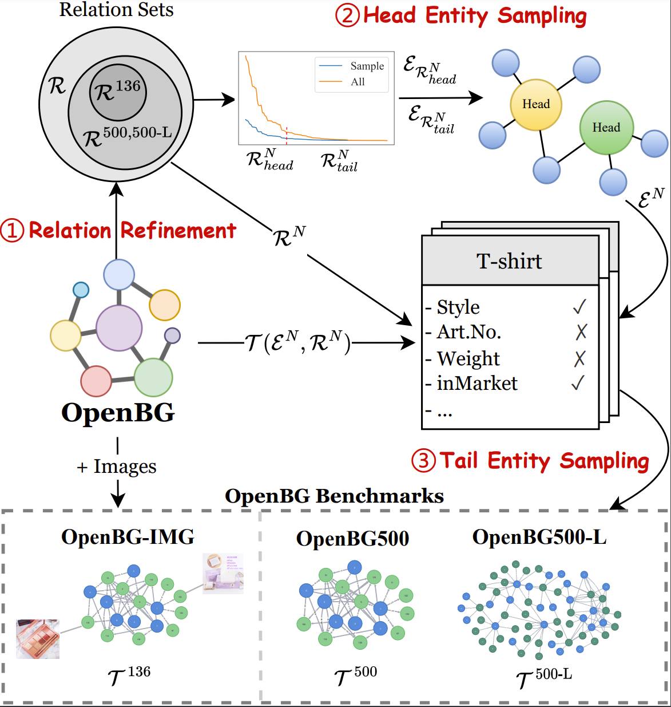
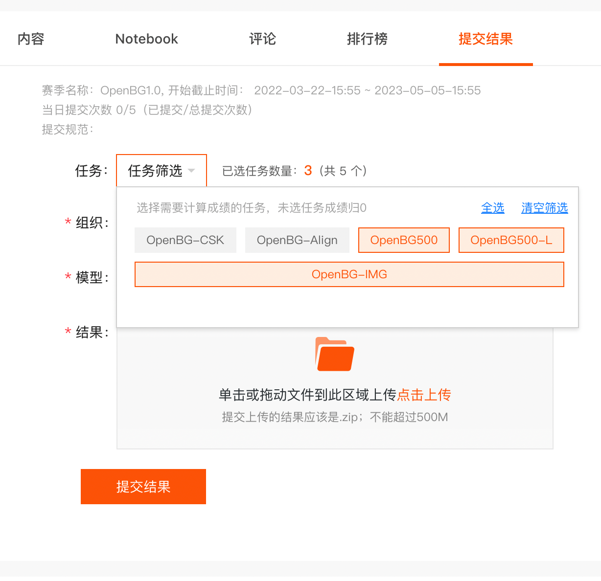

# OpenBG：Large Scale Open Business Knowledge Graph

[OpenBG](https://kg.alibaba.com/) is an open business knowledge graph that utilizes a unified Schema covering multi-modal datasets in large scale, which contains millions of products and consumer demand provided by ZJUKG Lab of Zhejiang University and the group of Alibaba Knowledge Engine.

[OpenBG Benchmark](https://tianchi.aliyun.com/dataset/dataDetail?dataId=122271) is a large-scale open business knowledge graph evaluation benchmark based on OpenBG, including multiple sub-datasets and sub-tasks. Welcome submision in [https://tianchi.aliyun.com/dataset/dataDetail?dataId=122271](https://tianchi.aliyun.com/dataset/dataDetail?dataId=122271).

## Building process of OpenBG benchmarks
<center></center>

## Datasets

Summary statistics of OpenBG datasets:
|    Dataset    |    # Ent   | # Rel |   # Train   |  # Dev  | # Test  |
| ------------- | ---------- | ----- | ----------- | ------- | ------- |
|   OpenBG-IMG  | 27,910     |  136  | 230,087     | 5,000   | 14,675  |
|   OpenBG500   | 249,743    |  500  | 1,242,550   | 5,000   |  5,000  |
|   OpenBG500-L | 2,782,223  |  500  | 47,410,032  | 10,000  | 10,000  |
|  OpenBG(Full) | 88,881,723 | 2,681 | 260,304,683 |    -    |    -    |

### OpenBG-IMG
OpenBG-IMG is a multi-modal dataset in the field of e-commmerce referring to [CCKS2022 Knowledge Processing and Application Evaluation for Digital Commerce Task 3: Multimodal Commodity Knowledge Graph Link Prediction](https://tianchi.aliyun.com/competition/entrance/531957/information). OpenBG-IMG here has an extra dev split and texts of entities and relations compared to the original dataset in CCKS. The test split refers to the preliminary contest.

**Input-output example:**
Input: (`Head`[some with `image`]<\t>`Relation`)
Output: (`Tail`)

#### Directory Tree

```shell
OpenBG-IMG
├───── OpenBG-IMG_images			# Set of images
	├── ent_xxxxxx					# Images of the entity
	...
├── OpenBG-IMG_train.tsv 			# Training set
├── OpenBG-IMG_dev.tsv 				# Validation set
├── OpenBG-IMG_test.tsv 			# Test set
├── OpenBG-IMG_entity2text.tsv 		# Description of entities in Chinese
├── OpenBG-IMG_relation2text.tsv 	# Description of relations in Chinese
└── OpenBG-IMG_example_pred.tsv 	# Submit example
```

### OpenBG500

OpenBG500 contains 500 relations, which is filtered and sampled from OpenBG(Full).

#### Directory Tree
```shell
OpenBG500
├── OpenBG500_train.tsv 			# Training set
├── OpenBG500_dev.tsv 				# Validation set
├── OpenBG500_test.tsv 			    # Test set
├── OpenBG500_entity2text.tsv 		# Description of entities in Chinese
├── OpenBG500_relation2text.tsv 	# Description of relations in Chinese
└── OpenBG500_example_pred.tsv 	    # Submit example
```

### OpenBG500-L

OpenBG500-L contains 500 relations(same as OpenBG500), larger than OpenBG500, which is also filtered and sampled from OpenBG(Full).

#### Directory Tree
```shell
OpenBG500-L
├── OpenBG500-L_train.tsv 			    # Training set
├── OpenBG500-L_dev.tsv 				# Validation set
├── OpenBG500-L_test.tsv 			    # Test set
├── OpenBG500-L_entity2text.tsv 		# Description of entities in Chinese
├── OpenBG500-L_relation2text.tsv 	    # Description of relations in Chinese
└── OpenBG500-L_example_pred.tsv 	    # Submit example
```

## Usage

### Format

* Triples

```shell
# {Dataset}_train.tsv/{Dataset}_dev.tsv
Head<\t>Relation<\t>Tail<\n>
```

* Description of entities/relations in Chinese

```shell
# {Dataset}_entity2text.tsv/{Dataset}_relation2text.tsv
Entity(Relation)<\t>Description of entitie(relation)<\n>
```

* Test and submit

```shell
# For {Dataset}_test.tsv, participants are required to predict 10 Tails for one instance. {Dataset}_example_pred.tsv is a submit example.
Head<\t>Relation<\n>

# {Dataset}_example_pred.tsv
Head<\t>Relation<\t>Tail 1<\t>Tail 2<\t>...<\t>Tail 10<\n>
```

### Read the datasets

1. Read the original data:
```python
with open('{Dataset}_train.tsv', 'r') as fp:
    data = fp.readlines()
    train = [line.strip('\n').split('\t') for line in data]
    _ = [print(line) for line in train[:2]]
    # ['ent_135492', 'rel_0352', 'ent_015651']
    # ['ent_020765', 'rel_0448', 'ent_214183']
```

2. Get the map of Entity(Relatioin)-Description: `ent2text` and `rel2text`:
```python
with open('{Dataset}_entity2text.tsv', 'r') as fp:
    data = fp.readlines()
    lines = [line.strip('\n').split('\t') for line in data]
    _ = [print(line) for line in lines[:2]]
    # ['ent_101705', '短袖T恤']
    # ['ent_116070', '套装']

ent2text = {line[0]: line[1] for line in lines}

with open('{Dataset}_relation2text.tsv', 'r') as fp:
    data = fp.readlines()
    lines = [line.strip().split('\t') for line in data]
    _ = [print(line) for line in lines[:2]]
    # ['rel_0418', '细分市场']
    # ['rel_0290', '关联场景']

rel2text = {line[0]: line[1] for line in lines}
```

3. Transfer the data to description: 
```python
train = [[ent2text[line[0]],rel2text[line[1]],ent2text[line[2]]] for line in train]
_ = [print(line) for line in train[:2]]
# ['苦荞茶', '外部材质', '苦荞麦']
# ['精品三姐妹硬糕', '口味', '原味硬糕850克【10包40块糕】']
```

## How to download

- Download link：

| Dataset       |   Google Drive   | Baidu Netdisk | 
| ------------- | ---------------- | ------ |
| OpenBG-IMG    | [Download](https://drive.google.com/file/d/1jg4YcFgOfgjUJCnxBjw9w-6ID8VS_L-X/view?usp=sharing)    |   [Password: ke65](https://pan.baidu.com/s/1rq1AGTSKLcfuIEnuq6gnJQ) |
| OpenBG500     |    [Download](https://drive.google.com/file/d/1pD_icqV-lLbCXN2rfBaq-Y5i_XcKVCzM/view?usp=sharing)    |   [Password: 78fw](https://pan.baidu.com/s/1NsRWct-u63QmxVgyjJeXsg) |
| OpenBG500-L   | [Download](https://drive.google.com/file/d/1DZZRqc8Yl9mfO66cOS8IKCuim_Bw2oOM/view?usp=sharing) | [Password: 767v](https://pan.baidu.com/s/1SbTs7HFfHIrYSlK_hoLxTg) |

- OpenBG(Full) is available at [kg.alibaba.com](https://kg.alibaba.com/).

## Submit in Alibaba TIANCHI

- OpenBG-IMG is available at [CCKS2022 Knowledge Processing and Application Evaluation for Digital Commerce Task 3: Multimodal Commodity Knowledge Graph Link Prediction](https://tianchi.aliyun.com/competition/entrance/531957/information), and the source code of baselines is https://github.com/OpenBGBenchmark/OpenBG-IMG .
- [OpenBG Benchmark：Large Scale Open Business Knowledge Graph Benchmark](https://tianchi.aliyun.com/dataset/dataDetail?dataId=122271) is a benchmark open for a long time.

### How to submit

- Results of [OpenBG Benchmark：大规模开放数字商业知识图谱评测基准](https://tianchi.aliyun.com/dataset/dataDetail?dataId=122271) can submit on the website:

<center></center>

1. Every submit file must follow the name format:
* OpenBG500: OpenBG500_test.tsv
* OpenBG500-L: OpenBG500-L_test.tsv
* OpenBG-IMG: OpenBG-IMG_test.tsv

2. Compress file to `.zip` and submit.

```
zip somename.zip  {Dataset}_test.tsv
```
